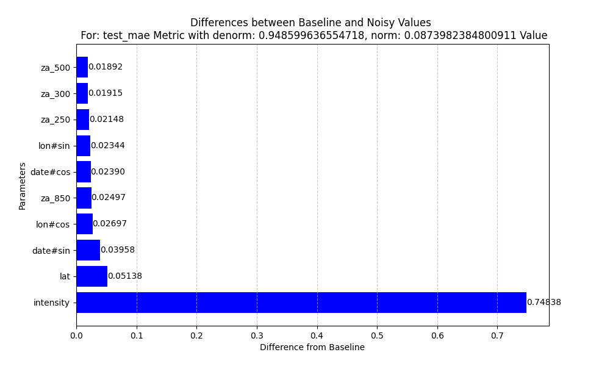

# Performance Evaluation of Storm Intensity prediction

## Dictionary

-   Lookback[t]h – the model is revealed t timesteps before realtime as input. If lookback is 0 or not mentioned it means the model only receives one timestep as input.
-   Forecast[t]h – the model will predict t timesteps forward.
-   Realtime – the model will predict 0 timesteps forward.
-   No_intensity – the intensity parameter will be left out from the model inputs.

## Naive Approach

### Experiment Setup

-   A linear model with no parameters
-   Mark $$t_{f i r s t} = t h e \  o l d e s t \  t i m e s t e p \  r e v e a l e d \  t o \  t h e \  m o d e l \  i n p u t \$$.
-   Mark $$t_{l a s t} = t h e \  n e w e s t \  t i m e s t e p \  r e v e a l e d \  t o \  t h e \  m o d e l \  i n p u t \$$.
-   Mark $$t_{f o r e c a s t} = t h e \  n e w e s t \  t i m e s t e p \  w e \  w i l l \  a t t e m p t \  t o \  f o r e c a s t \$$.
-   Mark $$I_{t} = t h e \  i n t e s i t y \  a t \  t i m e s t e p \  t$$
-   We will define the Naïve function to predict forecasted intensity:

    $$N \left( I_{t_{f i r s t}} , I_{t_{l a s t}} , t_{f i r s t} , t_{l a s t} , t_{f o r e c a s t} \right) = \begin{cases}I_{t_{l a s t}} + t_{f o r e c a s t} \cdot \frac{I_{t_{l a s t}} - I_{t_{f i r s t}}}{t_{f i r s t} - t_{l a s t}} , \  \  \  i f \  t_{f i r s t} \neq t_{l a s t} \\ I_{t_{l a s t}} \  \  , \  \  \  \  \  \  \  \  \  \  \  \  \  \  \  \  \  \  \  \  \  \  \  \  \  \  \  \  \  \  \  \  \  \  \  \  \  \  \  \  \  \  \  \  \  \  \  i f \  t_{f i r s t} = t_{l a s t}\end{cases}$$

### Results

| NAÏVE RUN             | Mean Absolute Error |
|-----------------------|---------------------|
| Forecast1h            | 1.697               |
| Forecast2h            | 3.18                |
| Lookback1h-Forecast1h | 1.065               |
| Lookback1h-Forecast2h | 2.432               |
| Lookback3h-Forecast1h | 1.35                |
| Lookback3h-Forecast2h | 2.875               |

### Conclusion

We have set up a benchmark for the rest of the experiment. These are the basic results we use to compare our experiments to.

## First Attempt at Training a Simple NN

### Experiment Setup

-   Training dataset years: 1990-2000
-   Validation was selected randomly. 25% holdout of training. Done deterministically across all experiments.
-   Trained 4 different simple NNs:
    -   Forecast1h
    -   Forecast2h
    -   Realtime
    -   Forecast1h, No_Intensity

### Results

| Simple NN               | Validation Mean Absolute Error |
|-------------------------|--------------------------------|
| Forecast1h              | 6.75                           |
| Forecast2h              | 6.55                           |
| Realtime                | 6.61                           |
| Forecast1h No_Intensity | 6.62                           |

### Training Process

Train Loss RMSE:

Validation Mean Absolute Error (MAE): 

### Conclusion

All versions reached an MAE of around 6.5-7 for the intensity parameter.

Forecast2h performed similarly to Forecast1h, sometimes better.  
Training loss over iterations was choppy, indicating suboptimal training, likely due to varying parameter scales.

We conclude that training does not converge. Next we will attempt to fix these problems by normalizing the input data.

## Normalized Data Simple NN Approach

### Experiment Setup

-   Training dataset years: 1990-2000
-   Validation was selected randomly. 25% holdout of training. Done deterministically across all experiments.
-   Mean and STD of data is calculated across all training dataset for each parameter. Then we subtract the mean and divide by the STD so that each feature is normalized around mean=0 and std=1.
-   Trained 4 different simple NNs on the normalized data:
    -   Forecast1h
    -   Forecast2h
    -   Realtime
    -   Forecast1h, No_Intensity

### Results

| Simple NN Normalized Inputs | Validation Mean Absolute Error |
|-----------------------------|--------------------------------|
| Forecast1h                  | 1.74                           |
| Forecast2h                  | 3.00                           |
| Realtime                    | 5.50                           |
| Forecast1h No_Intensity     | 5.62                           |

### Training Process

Train Loss RMSE: 

Validation Mean Absolute Error:

### Conclusion

Significant improvement: Forecast1h reached an MAE of 1.74 (compared to 6.7 for unnormalized data). All normalized networks performed significantly better.  
Training loss over iterations was less choppy.  
Forecast1h performed better than Forecast2h as expected.

## Enhancing the Model with Residual Connections

### Experiment Setup

-   Training dataset years: 1990-2000
-   Validation was selected randomly. 25% holdout of training. Done deterministically across all experiments.
-   Normalized Data (as before).
-   Added residual connections to the Simple NN from before.
-   Trained a Residual NN on normalized inputs and tested the Forecast1h version.

### Results

| Residual NN Normalized Inputs | Validation Mean Absolute Error |
|-------------------------------|--------------------------------|
| Forecast1h                    | 1.645                          |

### Training Process

Validation Mean Absolute Error. Residual NN (blue) vs. SimpleNN (orange):

### Conclusion

Improvement over the Simple NN: Residual NN reached an MAE of 1.645.

We have now successfully surpassed the Naïve model that only reached a MAE of 1.697 for Forecast1h without lookback.

## Data Processing and Feature Importance

### Experiment Setup

-   We wish to determine the importance of each parameter.
-   Noise was added to each parameter in the trained networks, and the impact on the MAE for the validation set was measured.

### Results

Forecast1h Residual NN Normalized:

Forecast1h Simple NN Normalized:

### Conclusion

-   The last intensity value was the most important parameter in networks where it was revealed.
-   za was also an important parameter.
-   Date and Lon were not beneficial due to their circular nature.

## Circular Unfolding for Circular Parameters

### Experiment Setup

-   Training dataset years: 1979-2024
-   Validation was selected randomly. 25% holdout of training. Done deterministically across all experiments.
-   Normalized data (as before).
-   Residual NN (as before).
-   Normalized date and lon to the range $$\lbrack 0 , 2 \pi \rbrack$$.
-   Added the sin and cos of the normalized date and lon parameters as inputs to the network.
-   Added a lookback3h.
-   Trained a Residual NN on normalized inputs and tested the Forecast1h version.

### Results

| Residual NN Normalized Inputs | Validation Mean Absolute Error |
|-------------------------------|--------------------------------|
| Lookback3h-Forecast1h         | 0.98                           |

### Training Process

Validation Mean Absolute Error:

### Feature Importance Analysis

### Conclusion

We have now successfully surpassed the best Naïve model that used a lookback. The best Naïve model used lookback1h only reached a MAE of 1.065 for Forecast1h. We have now been able to reach MAE of 0.98.

Notice how a lot of the parameters seem to be not important still. We will attempt to remove them and see how it affects performance.

## Reducing Unimportant Features

### Experiment Setup

-   Training dataset years: 1979-2024
-   Validation was selected randomly. 25% holdout of training. Done deterministically across all experiments.
-   Normalized data (as before).
-   Residual NN (as before).
-   Normalized date and lon to the range $$\lbrack 0 , 2 \pi \rbrack$$ (as before.
-   Added the sin and cos of the normalized date and lon parameters as inputs to the network (as before).
-   Added a lookback3h (as before).
-   Removed all features but: date, lon, lat, za, intensity.
-   Trained a Residual NN on normalized inputs and tested the Forecast1h version.

### Results

| Residual NN Normalized Reduced Inputs | Validation Mean Absolute Error |
|---------------------------------------|--------------------------------|
| Lookback3h-Forecast1h                 | 0.94                           |

### Training Process

Validation Mean Absolute Error:

### Feature Importance Analysis

### Conclusion

Further improved to 0.94 MAE on the validation set.

We concluded that the other parameters we left out were not important to the network as we were able to beat our best benchmark without them.

## Adding Skip Connection with Naïve Model Output

### Experiment Setup

-   Training dataset years: 1979-2024
-   Validation was selected randomly. 25% holdout of training. Done deterministically across all experiments.
-   Normalized data (as before).
-   Simple NN.
-   Normalized date and lon to the range $$\lbrack 0 , 2 \pi \rbrack$$ (as before.
-   Added the sin and cos of the normalized date and lon parameters as inputs to the network (as before).
-   Added a lookback3h (as before).
-   Removed all features but: date, lon, lat, za, intensity.
-   Added a skip connection to the last linear layer with the Naïve model outputs for lookbacks0-3h.
-   Initialized last lin layer weights to be ¼ for the skip connections and 0 for the rest of the neurons. Biases are initialized to 0.
-   Trained a Residual NN on normalized inputs and tested the Forecast1h version.

### Results

| Simple NN Normalized Reduced Inputs Skip Connection | Validation Mean Absolute Error |
|-----------------------------------------------------|--------------------------------|
| Lookback3h-Forecast1h                               | 0.89                           |

### Training Process

Validation Mean Absolute Error:

### Feature Importance Analysis

### Conclusion

Further improved to 0.89 MAE on the validation set.
